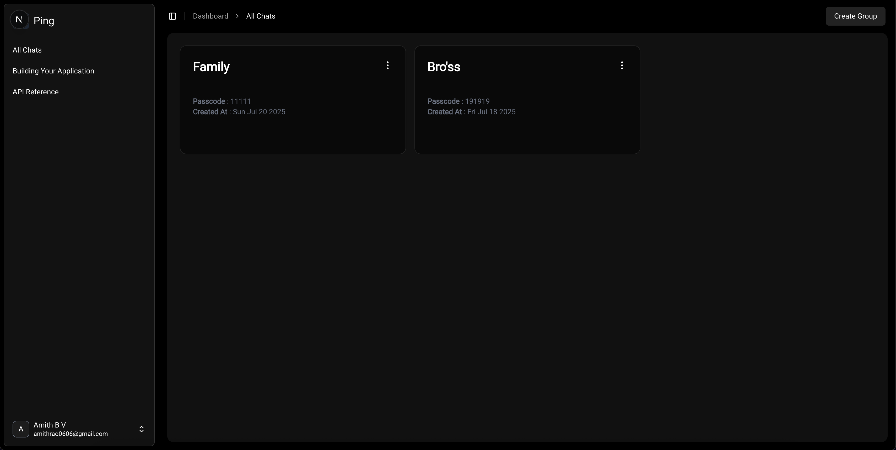
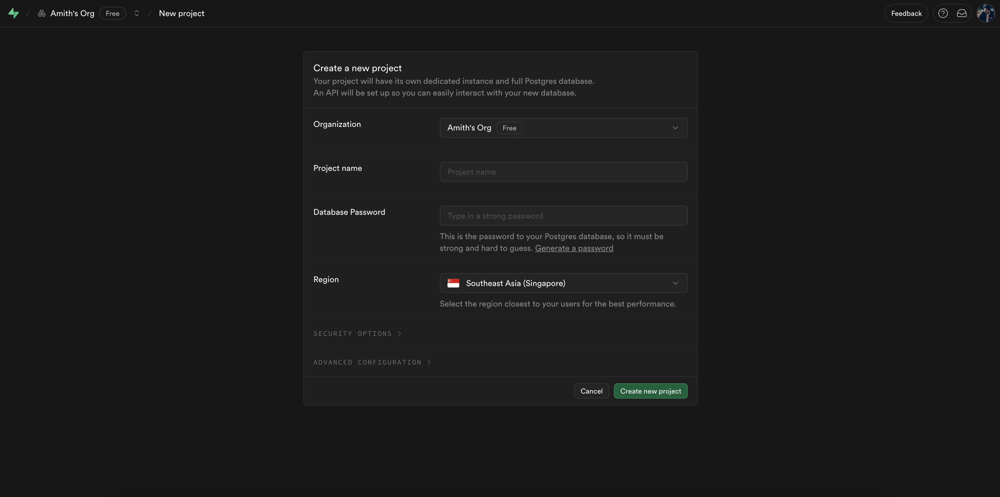
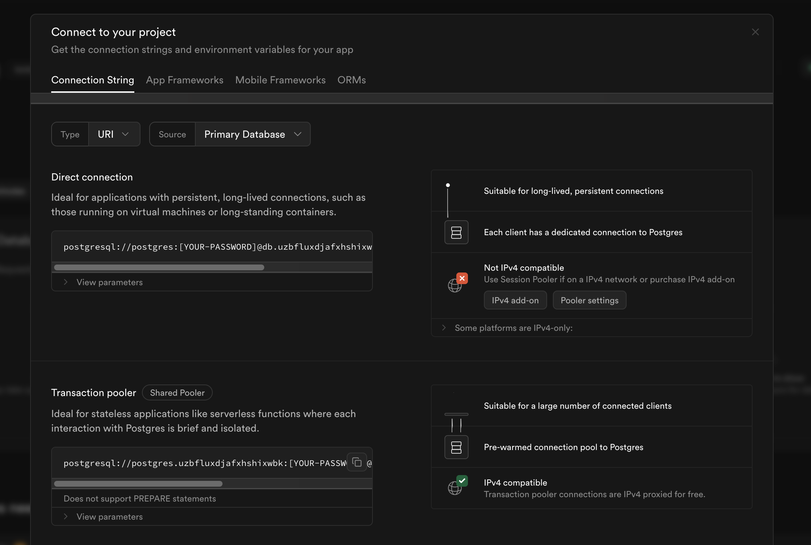
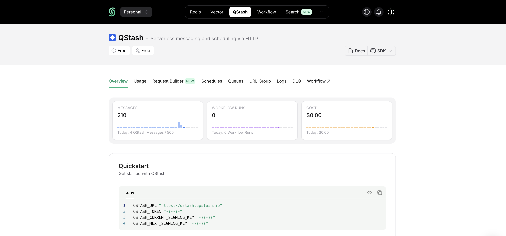
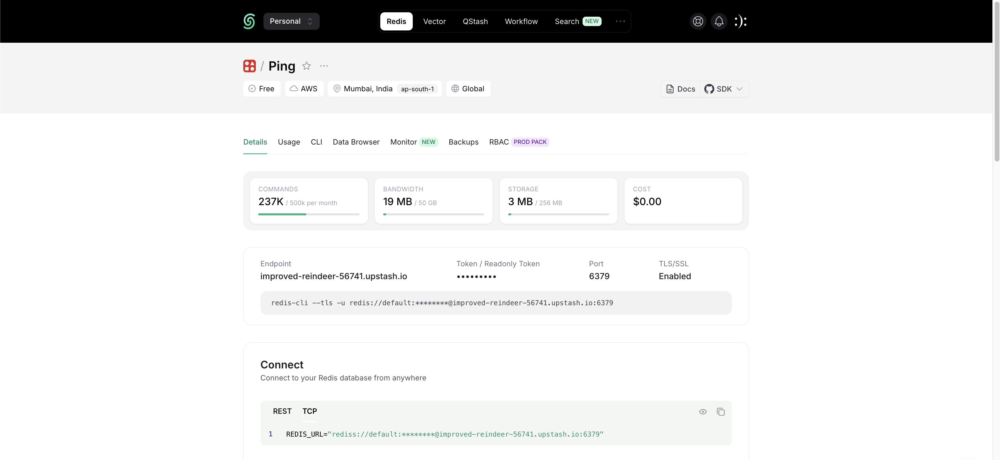
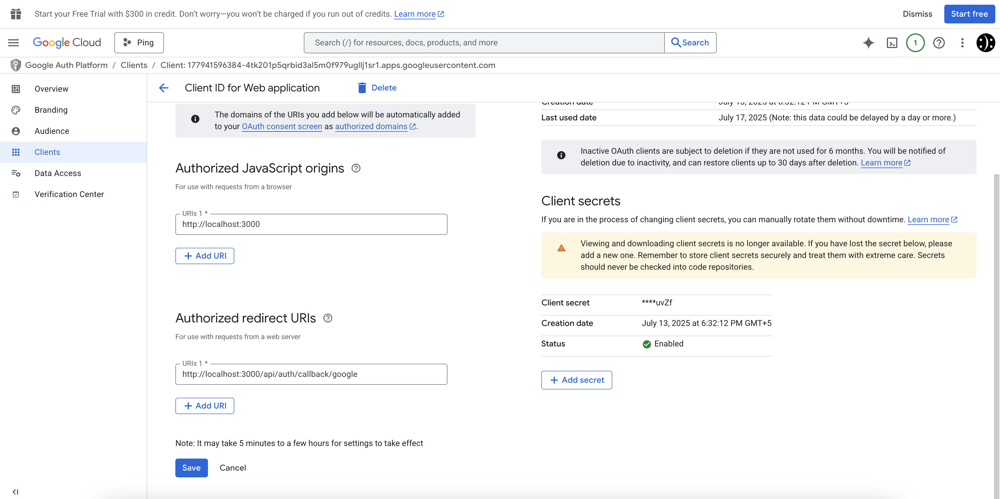

# 🚀 Ping



Ping is a scalable real-time chat application built with a modern full-stack tech stack. It supports efficient communication between users using WebSockets and a Redis-backed message queue system.

##

### 🧩 Tech Stack

#### Frontend 

- **Framework:** [Next.js](https://nextjs.org/) + **TypeScript**
- **Authentication:** [Next-Auth](https://next-auth.js.org/)
- **Forms & Validation:** [React Hook Form](https://react-hook-form.com/), [Zod](https://zod.dev/)
- **Styling:** [Tailwind CSS](https://tailwindcss.com/), [Shadcn UI](https://ui.shadcn.com/), [Aceternity UI](https://aceternity-ui.vercel.app/), [Magic UI](https://magicui.design/)
- **Animation:** [Framer Motion](https://www.framer.com/motion/)
- **Realtime Client:** [Socket.io-client](https://socket.io/)

#### Backend

- **Server:** Node.js + Express + TypeScript
- **ORM:** [Prisma](https://www.prisma.io/)
- **Database:** PostgreSQL (hosted on [Supabase](https://supabase.com/))
- **WebSocket Server:** [Socket.io](https://socket.io/)
- **Messaging Queue:** [QStash](https://upstash.com/qstash) from Upstash
- **Redis:** [ioredis](https://github.com/luin/ioredis) + Upstash Redis with `@socket.io/redis-streams-adapter`
- **Auth:** JSON Web Tokens (JWT)

##

### 🛠 Features

- 🔐 Secure user authentication with NextAuth
- 💬 Real-time messaging via Socket.io
- 📬 Messaging queue powered by QStash for scalable message delivery
- 🧠 Form validation with Zod & React Hook Form
- 🌈 Beautiful UI powered by TailwindCSS and popular UI kits
- 🧩 Scalable architecture using Redis pub/sub and streams
- ⚡ Optimistic UI and smooth transitions with Framer Motion

##

### 🧪 Project Structure

```
/backend # Backend (Express + Socket.io)
/frontend # Frontend (Next.js)
README.md
```

##

### ⚙️ Project Setup

1. **Clone the repository** :

```bash
git clone https://github.com/AmithBV0606/Ping.git
cd Ping
```

2. **Open the project in the code editor of your choice.**
   
3. **Start with setting up the backend** :

```bash
cd backend
npm install
```

4. **Create an `.env` file.**

5. **Copy the environment variables from `.env.sample` to `.env`**

```bash
NODE_ENV="development"

# Supabase DB Credentials :
DATABASE_URL="YOUR_DB_URL"
JWT_SECRET="YOUR_JWT_SECRET" # Name the secret whatever you want

# QStash Credentials :
QSTASH_TOKEN="YOUR_QSTASH_TOKEN"
QSTASH_CURRENT_SIGNING_KEY="YOUR_QSTASH_CURRENT_SIGNING_KEY"
QSTASH_NEXT_SIGNING_KEY="YOUR_QSTASH_NEXT_SIGNING_KEY"

# Redis Credentials : 
UPSTASH_REDIS_REST_URL="YOUR_UPSTASH_REDIS_REST_URL"
UPSTASH_REDIS_REST_TOKEN="YOUR_UPSTASH_REDIS_REST_TOKEN"
```

6. **Database Url** :

- Create an account on [Supabase](https://supabase.com/). 
  
- Then create a project.


- Copy the url from "Transaction pooler" and past it in `.env` :


7. **QStash setup** :

- Create an account on [Upstash](https://upstash.com/).

- Navigate to the "QStash" tab. Then copy the credentials and past it in `.env`.


8. **Redis setup** :

NOTE : For local developemnt you don't need hosted redis instance from Upstash, instead we can use "redis/redis-stack" image from [docker hub](https://hub.docker.com/r/redis/redis-stack).

Before running the following command make sure you have [docker-desktop](https://www.docker.com/products/docker-desktop/) installed on your PC.

```bash
docker run -d --name redis-stack -p 6379:6379 -p 8001:8001 -e REDIS_ARGS="--requirepass mypassword" redis/redis-stack:latest
```

But if you want to use the **hosted redis** :

- Navigate to the "Redis" tab.
 
- Create a new Redis database.

- Then copy the credentials and past it in `.env`.



- Then change the `NODE_ENV` to production.

NOTE : Copy the "TCP" version REDIS URL.

9. **Start the backend server** :

```bash
npm run dev
```

10. **Now start setting up frontend** :

```bash
cd ..
cd frontend
npm install
```

11. **Create an `.env` file. Then Copy the environment variables from `.env.sample` to `.env`** :

```bash
NEXTAUTH_URL=http://localhost:3000
NEXTAUTH_SECRET="ADD_WHATEVER_YOU_WANT"

GOOGLE_CLIENT_ID="YOUR_GOOGLE_CLIENT_ID"
GOOGLE_CLIENT_SECRET="YOUR_GOOGLE_CLIENT_SECRET"

NEXT_PUBLIC_APP_URL=http://localhost:3000
NEXT_PUBLIC_BACKEND_URL=http://localhost:4000
```

12. **Get Client-Id and Client-Secret from Google**:

- Follow this tutorial to get Google Client-id an secret. 
  
  https://youtu.be/D8DMj2lQMwo?si=rUwjkuJBo2cXA8bc



NOTE : For Authorized JavaScript origins and Authorized redirect URIs use the links in the above image.

##

### 🧠 Future Improvements :

- Add the profile page for the user.

##

### 🧑‍💻 Author :
Made with 💚 by Amith B V